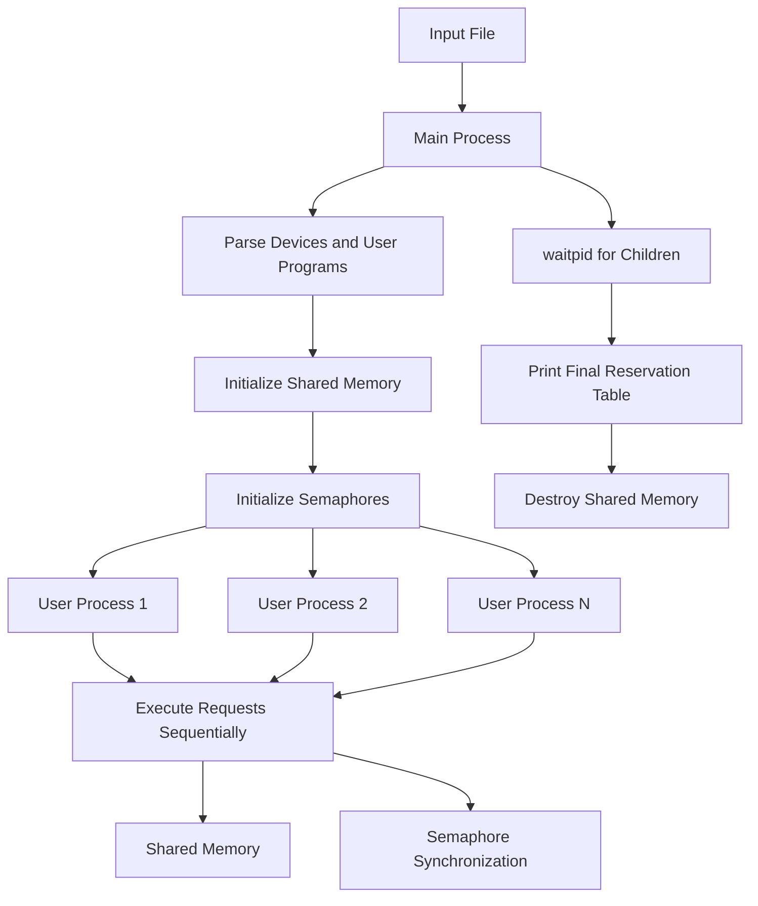
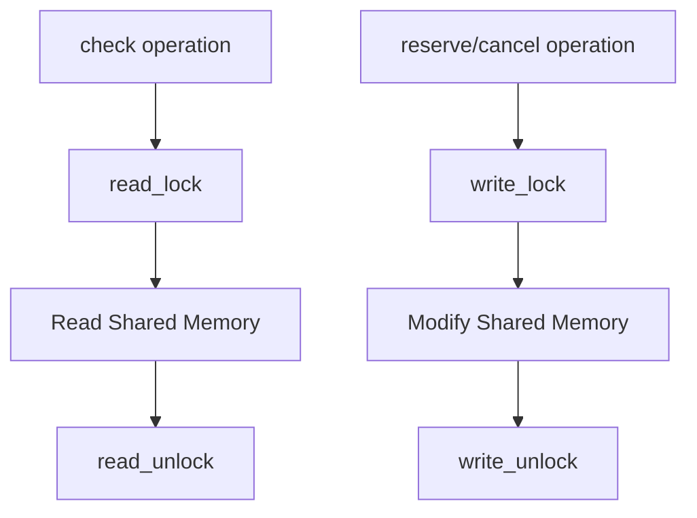
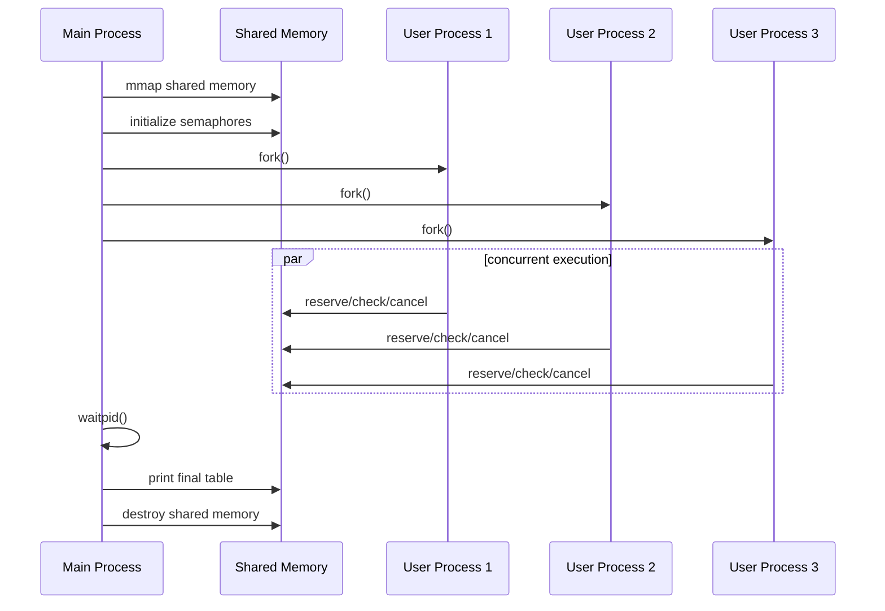

# Report: Linux Multi-process Device Reservation System
## 1. Experiment Purpose
The purpose of this project is to implement a concurrent device reservation system under Linux and to understand the use of advanced IPC mechanisms in a realistic multi-process scenario.

The project focuses on the following goals:
1. Use multiple processes to simulate concurrent users.
2. Use shared memory to store common system data.
3. Use semaphores to protect shared data and guarantee consistency.
4. Implement atomic reservation and cancellation transactions.
5. Handle conflicts caused by concurrent access to the same device.
6. Support partial cancellation and interval splitting.
7. Improve understanding of Linux process control, synchronization, and shared-memory programming.

This project simulates a laboratory equipment reservation system. Each user may reserve devices, cancel reservations, or query reservation information. Since multiple users may operate on the same device at the same time, proper synchronization is required.

## 2. Requirement Analysis
According to the project requirements, the system needs to support three types of reservation operations:
1. `reserve`
2. `reserveblock`
3. `reserveany`

It also needs to support three types of cancellation operations:
1. `cancel`
2. `cancelblock`
3. `cancelany`

In addition, it supports:
```text
check user_name
```

for querying the current reservations of a user.

The key requirements are:
- Each user must be represented by one process.
- Reservation data must be stored in shared memory.
- Access to shared memory must be synchronized using semaphores.
- Concurrent operations must not corrupt reservation data.
- Block and any operations must be atomic.
- Partial cancellation must be supported.
- The final reservation table must be printed after all user processes finish.

## 3. Overall Design
### 3.1 Architecture
The original design idea was a client/server architecture. The client would send requests to the server through sockets, and the server would dispatch requests to user processes.

However, socket communication is not required by the experiment. Therefore, this implementation focuses on the server-side logic. The program reads a test file directly and creates one process for each user block.

The actual architecture is:


Each child process executes all requests in its corresponding user block sequentially. Different user processes execute concurrently.

## 4. Program Framework
The project is divided into several modules.

### 4.1 `main.cpp`
Main responsibilities:
- Read the input file path.
- Parse the input file.
- Initialize shared memory and semaphores.
- Create one child process for each user.
- Wait for all child processes.
- Print the final reservation table.
- Destroy shared memory and semaphores.

Important system calls:
```cpp
fork();
waitpid();
_exit();
```

### 4.2 `InputParser`
This module parses the input file.

It reads:
- Device count
- Device IDs
- User count
- Operation delay settings
- User request sequences

The parsed result is stored as:
```cpp
struct UserProgram
{
    int reserve_delay;
    int cancel_delay;
    int check_delay;
    std::vector<Request> requests;
};
```

Each `UserProgram` corresponds to one user process.

### 4.3 `SharedMemoryManager`
This module manages shared memory initialization and destruction.

The shared memory is created using:
```cpp
mmap()
```

with:
```cpp
MAP_SHARED | MAP_ANONYMOUS
```

The shared data structure is:
```cpp
struct SharedData
{
    shm_sem_t resource_sem;
    shm_sem_t read_mutex_sem;
    shm_sem_t print_sem;

    int read_count;

    int device_count;
    DeviceEntry devices[MAX_DEVICES];

    int user_count;
    UserEntry users[MAX_USERS];

    ReservationEntry reservations[MAX_RESERVATIONS];

    uint64_t device_to_res[MAX_DEVICES][RES_WORDS];
    uint64_t day_to_res[DAYS_2026_2027][RES_WORDS];
    uint64_t user_to_res[MAX_USERS][RES_WORDS];
};
```

This structure stores all global data required by the system.

### 4.4 `SyncManager`
This module implements synchronization.

It provides:
```cpp
read_lock();
read_unlock();
write_lock();
write_unlock();
```

The synchronization model is a readers-writer lock implemented using POSIX semaphores.

- `check` uses the read lock.
- `reserve` and `cancel` operations use the write lock.
- Multiple readers may execute concurrently.
- Writers are mutually exclusive.
- A writer blocks all readers.

The logic is:


### 4.5 `RequestExecutor`
This module executes parsed requests.

It dispatches requests according to operation type:
```cpp
reserve
reserveblock
reserveany
cancel
cancelblock
cancelany
check
```

For reservation and cancellation operations, it:
1. Parses arguments.
2. Converts the date to a day index.
3. Acquires the write lock.
4. Sleeps for the configured delay.
5. Executes the operation.
6. Prints the result.
7. Releases the write lock.

For query operations, it calls:
```cpp
ReservationManager::check_user()
```

which uses the read lock.

### 4.6 `DeviceManager`
This module manages device-related operations.

Main functions:
```cpp
find_device_index()
get_device_id_by_index()
min_device_id()
max_device_id()
build_block_devices()
```

Device IDs may be non-continuous. Therefore, the system stores all valid device IDs in the device table and checks validity explicitly.

For `reserveblock` and `cancelblock`, the system supports circular consecutive device IDs. For example, if valid devices are:
```text
1 2 3 4 5
```

then a block starting from device `4` with count `3` is:
```text
4 5 1
```

### 4.7 `UserManager`
This module manages user names and user IDs.

Main functions:
```cpp
get_or_create_user()
find_user()
get_user_name()
```

The user table is stored in shared memory. Each user name is mapped to an integer user ID.

### 4.8 `ReservationManager`
This is the core module of the system.

It is responsible for:
- Adding reservations
- Removing reservations
- Checking device conflicts
- Performing atomic reservation
- Performing atomic cancellation
- Splitting intervals during partial cancellation
- Finding available devices for `reserveany`
- Finding cancellable devices for `cancelany`
- Printing user reservations
- Printing the final reservation table

## 5. Shared Memory Data Design
The shared memory contains three main tables and three inverted indexes.

### 5.1 Device Table
```cpp
struct DeviceEntry
{
    int valid;
    int device_id;
};
```

The device table records all valid device IDs.

Since device IDs may be non-continuous, the system uses an internal device index to access arrays. The external `device_id` is mapped to an internal index by linear search.

### 5.2 User Table
```cpp
struct UserEntry
{
    int valid;
    char name[MAX_NAME_LEN];
};
```

The user table maps user names to internal user IDs.

### 5.3 Reservation Table
```cpp
struct ReservationEntry
{
    int active;
    int user_id;
    int device_index;
    int start_day;
    int end_day;
};
```

Each reservation record stores:
- Whether the record is active
- User ID
- Device index
- Start day
- End day

The interval format is:
```text
[start_day, end_day)
```

This representation simplifies conflict detection.

### 5.4 Inverted Indexes
The system maintains three inverted indexes:
```cpp
uint64_t device_to_res[MAX_DEVICES][RES_WORDS];
uint64_t day_to_res[DAYS_2026_2027][RES_WORDS];
uint64_t user_to_res[MAX_USERS][RES_WORDS];
```

They represent:
1. Device ID to reservation IDs
2. Day index to reservation IDs
3. User ID to reservation IDs

The indexes are implemented with bitsets. Each bit represents whether a reservation ID belongs to the corresponding object.

For example:
```text
device_to_res[device_index]
```

contains all reservation IDs related to the given device.

This design avoids using STL containers in shared memory and keeps the memory layout fixed.

## 6. Date and Interval Design
All reservation dates are limited to 2026 and 2027.

The system converts dates to day indexes:
```text
2026-01-01 -> 0
2026-01-02 -> 1
...
2027-01-01 -> 365
...
2027-12-31 -> 729
```

The constant is:
```cpp
DAYS_2026_2027 = 365 + 365
```

Both 2026 and 2027 are common years.

Each reservation is stored as a left-closed, right-open interval:
```text
[start_day, end_day)
```

For two intervals:
```text
[l1, r1)
[l2, r2)
```

they overlap if and only if:
```cpp
l1 < r2 && l2 < r1
```

This condition is used to detect device conflicts.

## 7. Synchronization Design
### 7.1 Semaphores
The system uses three semaphores:
```cpp
resource_sem
read_mutex_sem
print_sem
```

Their purposes are:
| Semaphore        | Purpose                         |
| ---------------- | ------------------------------- |
| `resource_sem`   | Protect shared reservation data |
| `read_mutex_sem` | Protect `read_count`            |
| `print_sem`      | Prevent interleaved output      |

On Linux, they are initialized as process-shared unnamed POSIX semaphores:
```cpp
sem_init(&g_shm->resource_sem, 1, 1);
sem_init(&g_shm->read_mutex_sem, 1, 1);
sem_init(&g_shm->print_sem, 1, 1);
```

### 7.2 Readers-Writer Lock
The readers-writer lock is implemented as follows:
```cpp
void SyncManager::read_lock()
{
    sem_wait(&read_mutex_sem);
    read_count++;
    if (read_count == 1)
        sem_wait(&resource_sem);
    sem_post(&read_mutex_sem);
}
```

```cpp
void SyncManager::read_unlock()
{
    sem_wait(&read_mutex_sem);
    read_count--;
    if (read_count == 0)
        sem_post(&resource_sem);
    sem_post(&read_mutex_sem);
}
```

```cpp
void SyncManager::write_lock()
{
    sem_wait(&resource_sem);
}
```

```cpp
void SyncManager::write_unlock()
{
    sem_post(&resource_sem);
}
```

This allows concurrent read operations but serializes all write operations.

### 7.3 Deadlock Avoidance
The system avoids deadlock by using a simple lock acquisition rule:
- Read operations acquire only the read-side lock.
- Write operations acquire only `resource_sem`.
- No operation holds multiple resource locks in different orders.
- All locks are released before the function returns.
- Output is protected by a separate `print_sem`.

Since there is no circular waiting condition, deadlock is avoided.

## 8. Reservation Implementation
### 8.1 Single-device Reservation
For:
```text
reserve device_id year month day duration user_name
```

the system:
1. Checks argument validity.
2. Converts the date to `[start_day, end_day)`.
3. Acquires the write lock.
4. Checks whether the device exists.
5. Checks whether the device is busy.
6. Creates the user if necessary.
7. Adds one reservation record.
8. Updates inverted indexes.
9. Releases the write lock.

If the device does not exist, the output is:
```text
invalid device
```

If the device is already occupied during the target interval, the output is:
```text
device busy
```

### 8.2 Block Reservation
For:
```text
reserveblock device_count first_device_id year month day duration user_name
```

the system first builds a device list according to circular consecutive device IDs.

Example:
```text
valid devices: 1 2 3 4 5
reserveblock 3 4 ...
```

The selected devices are:
```text
4 5 1
```

The operation is atomic:
- If all devices are available, all reservations are inserted.
- If any device is invalid or busy, no reservation is inserted.

### 8.3 Any-device Reservation
For:
```text
reserveany device_count year month day duration user_name
```

the system scans the device table and selects the first `device_count` available devices.

If enough available devices are found, all are reserved atomically.

If not enough devices are available, the operation fails with:
```text
device busy
```

## 9. Cancellation Implementation
### 9.1 Single-device Cancellation
For:
```text
cancel device_id year month day duration user_name
```

the system:
1. Checks whether the device exists.
2. Finds a reservation of the user that fully covers the cancellation interval.
3. If such a reservation exists, cancels the interval.
4. If the cancelled interval is in the middle of a reservation, splits the original reservation into two parts.

For example, suppose Alice has:
```text
device 1: [2026-01-01, 2026-01-06)
```

After:
```text
cancel 1 2026 1 2 2 Alice
```

the cancellation interval is:
```text
[2026-01-02, 2026-01-04)
```

The remaining reservations are:
```text
[2026-01-01, 2026-01-02)
[2026-01-04, 2026-01-06)
```

This satisfies the partial cancellation requirement.

### 9.2 Permission Check
If a reservation exists in the interval but belongs to another user, the operation fails with:
```text
permission denied
```

If no matching reservation exists, the operation fails with:
```text
no such reservation
```

### 9.3 Block Cancellation
For:
```text
cancelblock device_count first_device_id year month day duration user_name
```

the system builds a circular consecutive device list and checks all devices.

The operation is atomic:
- If the user owns valid reservations on all target devices, all are cancelled.
- Otherwise, no reservation is modified.

### 9.4 Any-device Cancellation
For:
```text
cancelany device_count year month day duration user_name
```

the system searches devices on which the user has reservations covering the target interval.

If at least `device_count` such devices are found, the selected reservations are cancelled atomically.

The output includes the actual cancelled devices.

## 10. Atomicity Design
Atomicity is achieved by two mechanisms.

First, all write operations are protected by the write lock:
```cpp
SyncManager::write_lock();
...
SyncManager::write_unlock();
```

Second, block and any operations use a check-before-modify strategy.

For reservation:
```cpp
can_reserve_all(...)
```

is called before any reservation is inserted.

For cancellation:
```cpp
can_cancel_all(...)
```

is called before any reservation is removed.

Only when the entire pre-check succeeds does the system modify the shared data.

Therefore, operations such as `reserveblock`, `reserveany`, `cancelblock`, and `cancelany` satisfy the all-or-nothing requirement.

## 11. Process Model
Each user block in the input file is executed by one child process.

The main process executes:
```cpp
pid_t pid = fork();
```

For each child process:
```cpp
child_run(programs[i]);
```

Inside the child process, the requests of this user are executed sequentially:
```cpp
for each request:
    executor.execute(request)
```

Different user processes execute concurrently.

The process model can be represented as:


## 12. Output Design
The program prints the result of each request.

Successful reservation examples:
```text
reserve success: device 1
reserveblock success: devices [4 5 1]
reserveany success: devices [2 3]
```

Failed reservation examples:
```text
reserve failed: invalid device
reserve failed: device busy
```

Successful cancellation examples:
```text
cancel success: device 1
cancelblock success: devices [1 2 3]
cancelany success: devices [1]
```

Failed cancellation examples:
```text
cancel failed: no such reservation
cancel failed: permission denied
```

At the end, the final reservation table is printed:
```text
========== Final Reservation Table ==========
Device 1:
  user=Alice start=2026-01-01 end=2026-01-02
Device 2:
  empty
=============================================
```

This format is also used by the stress test script to verify consistency.

## 13. Testing
### 13.1 Functional Test
The provided test file covers:
- Single-device reservation
- Reservation conflict
- Partial cancellation
- User query
- Circular block reservation
- Automatic device allocation
- Automatic cancellation

Test command:
```bash
./build/test_server ./assets/tests/test.txt
```

Observed output:
```text
[PID 422295] reserve success: device 1
[PID 422295] check Alice
  device_id=1 start=2026-01-01 end=2026-01-06

[PID 422297] reserveblock success: devices [4 5 1]
[PID 422297] check Carol
  device_id=4 start=2026-02-01 end=2026-02-03
  device_id=5 start=2026-02-01 end=2026-02-03
  device_id=1 start=2026-02-01 end=2026-02-03

[PID 422297] cancelany success: devices [1]
[PID 422297] check Carol
  device_id=4 start=2026-02-01 end=2026-02-03
  device_id=5 start=2026-02-01 end=2026-02-03

[PID 422295] cancel success: device 1
[PID 422295] check Alice
  device_id=1 start=2026-01-01 end=2026-01-02
  device_id=1 start=2026-01-04 end=2026-01-06

[PID 422296] reserve failed: device busy
[PID 422296] reserveany success: devices [2 3]
[PID 422296] check Bob
  device_id=2 start=2026-01-01 end=2026-01-04
  device_id=3 start=2026-01-01 end=2026-01-04
```

Final table:
```text
========== Final Reservation Table ==========
Device 1:
  user=Alice start=2026-01-01 end=2026-01-02
  user=Alice start=2026-01-04 end=2026-01-06
Device 2:
  user=Bob start=2026-01-01 end=2026-01-04
Device 3:
  user=Bob start=2026-01-01 end=2026-01-04
Device 4:
  user=Carol start=2026-02-01 end=2026-02-03
Device 5:
  user=Carol start=2026-02-01 end=2026-02-03
=============================================
```

The result shows that:
- Alice's reservation was partially cancelled and split correctly.
- Bob's reservation on device 1 failed because the device was busy.
- Bob successfully reserved any two available devices.
- Carol successfully reserved a circular block `[4 5 1]`.
- Carol successfully cancelled one of her reservations using `cancelany`.

### 13.2 Stress Test
A Python stress test script is provided.

The script randomly generates input files and runs the program repeatedly. It then parses the final reservation table and checks consistency using SQLite.

Example command:
```bash
python3 stress_test.py ./build/test_server -n 100 --users 8 --devices 16 --ops 40 --seed 123
```

The script checks:
1. Whether every reservation uses a valid device.
2. Whether every date interval is valid.
3. Whether overlapping reservations exist on the same device.
4. Whether user names are valid.

This test helps verify that concurrent operations do not break data consistency.

## 14. Efficiency Analysis
### 14.1 Advantages
The system uses fixed-size arrays in shared memory. This has several advantages:
- Simple memory layout
- No dynamic allocation inside shared memory
- Easy to share between processes
- Fast random access by internal ID

The bitset-based inverted indexes also reduce the need to scan unrelated records in some cases.

### 14.2 Complexity
Some operations still use linear scans.

For example:
- Device lookup is `O(number_of_devices)`.
- Finding a free reservation slot is `O(MAX_RESERVATIONS)`.
- Checking device conflicts may scan reservation bits for the device.

Given the project limits:
```text
MAX_DEVICES = 128
MAX_USERS = 255
MAX_RESERVATIONS = 4096
```

this approach is acceptable for the experiment.

### 14.3 Concurrency
The system allows multiple `check` operations to run concurrently.

However, all reservation and cancellation operations are serialized by the write lock. This simplifies correctness and atomicity, but limits write concurrency.

A possible future optimization is to use finer-grained locks, such as one lock per device, while carefully avoiding deadlocks for block operations.

## 15. Portability
The main target platform is Linux.

On Linux, the program uses:
- `fork`
- `waitpid`
- `mmap`
- process-shared unnamed POSIX semaphores

For macOS compatibility, `config.h` and `SharedMemoryManager.cpp` contain conditional code using named semaphores:

```cpp
#ifdef __APPLE__
    sem_open(...)
#else
    sem_init(...)
#endif
```

This allows the program to compile and run on macOS for development convenience, although the experiment requirement is Linux-oriented.

## 16. Known Limitations
1. Socket communication is not implemented.
    - The current implementation directly reads the test file and forks user processes. This satisfies the core IPC and concurrency requirements but does not include the optional client/server socket layer.
2. Shared memory size is fixed.
    - The maximum number of devices, users, and reservations is configured in `config.h`.
3. Device lookup is linear.
    - Since STL containers are not used in shared memory, the current version uses arrays and linear search.
4. Write operations are globally serialized.
    - This design guarantees correctness but does not maximize write concurrency.
5. Writer starvation may theoretically occur.
    - The current readers-writer lock is reader-preferred. In a workload with continuous readers, a writer may wait for a long time. In the current experiment workload, this is not a serious issue.

## 17. Possible Improvements
Future improvements may include:
1. Implementing the socket-based client/server architecture.
2. Using finer-grained locks, such as per-device locks.
3. Adding a writer-preferred readers-writer lock to avoid writer starvation.
4. Replacing linear search with hash tables or B+ trees in shared memory.
5. Supporting dynamic expansion of the reservation table.
6. Improving output order by collecting logs in shared memory.
7. Adding more detailed error handling for malformed input.
8. Supporting persistent storage.

## 18. Experiment Summary
Through this project, I implemented a complete multi-process concurrent reservation system using Linux IPC mechanisms.

The most important part of the project was ensuring correctness under concurrency. Shared memory allows all user processes to access the same reservation data, but it also introduces race conditions. To solve this problem, I used POSIX semaphores to build a readers-writer lock. Reservation and cancellation operations are protected by the write lock, while query operations use the read lock.

Another important part was atomic transaction handling. For `reserveblock`, `reserveany`, `cancelblock`, and `cancelany`, the system first checks whether the whole operation can succeed. Only after the pre-check succeeds does it modify the reservation table. This ensures that these operations either fully succeed or fully fail.

The project also deepened my understanding of interval management. By storing reservations as left-closed and right-open intervals, conflict detection and partial cancellation become simpler and less error-prone.

Overall, this experiment helped me better understand:
- Linux process creation
- Shared memory programming
- Semaphore synchronization
- Readers-writer locking
- Atomic operation design
- Concurrent data consistency
- Reservation interval splitting

The final program satisfies the main requirements of the course project and can be tested with both fixed test cases and randomized stress tests.
